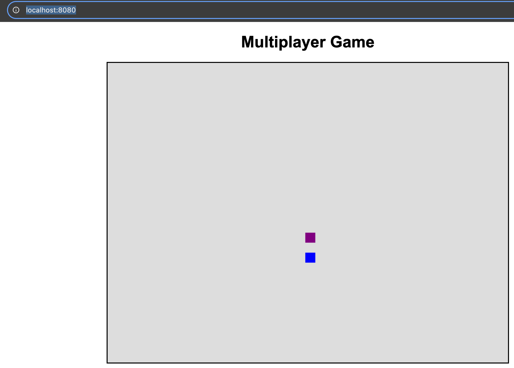

# go-multiplayer-game (in future)

This project implements a multiplayer movement of sprites in go.

Note: I was going through the blog by healey https://healeycodes.com/2d-multiplayer-from-scratch and it inspired me to try this.

Steps
1. run the main.go file via go run go-multiplayer-game/main.go
2. open new terminals and run wscat -c ws://localhost:8080/ws. Each new session is a new player now type commands like up,down and the player positions are updated at server end
3. (or) open http://localhost:8080/ in multiple tabs and start pressing left/right/up/down keys and the sprites gonna move

this is how the game looks like


this is how the logs look like

```
go-multiplayer-game % go run main.go
2025/02/26 09:24:12 WebSocket server running on ws://localhost:8080/ws
2025/02/26 09:24:15 New Player connected: 1740542055820225000
2025/02/26 09:24:17 Broadcasting game state: {"1740542055820225000":{"ID":"1740542055820225000","X":395,"Y":400,"color":"blue"}}
2025/02/26 09:24:17 Broadcasting game state: {"1740542055820225000":{"ID":"1740542055820225000","X":395,"Y":395,"color":"blue"}}
2025/02/26 09:24:17 Broadcasting game state: {"1740542055820225000":{"ID":"1740542055820225000","X":395,"Y":390,"color":"blue"}}
2025/02/26 09:24:17 Broadcasting game state: {"1740542055820225000":{"ID":"1740542055820225000","X":395,"Y":385,"color":"blue"}}
2025/02/26 09:24:18 Broadcasting game state: {"1740542055820225000":{"ID":"1740542055820225000","X":395,"Y":380,"color":"blue"}}
2025/02/26 09:24:20 New Player connected: 1740542060230895000
2025/02/26 09:24:20 Broadcasting game state: {"1740542055820225000":{"ID":"1740542055820225000","X":395,"Y":380,"color":"blue"},"1740542060230895000":{"ID":"1740542060230895000","X":395,"Y":400,"color":"purple"}}
2025/02/26 09:24:21 Broadcasting game state: {"1740542055820225000":{"ID":"1740542055820225000","X":395,"Y":380,"color":"blue"},"1740542060230895000":{"ID":"1740542060230895000","X":395,"Y":395,"color":"purple"}}
2025/02/26 09:24:21 Broadcasting game state: {"1740542055820225000":{"ID":"1740542055820225000","X":395,"Y":380,"color":"blue"},"1740542060230895000":{"ID":"1740542060230895000","X":395,"Y":390,"color":"purple"}}
2025/02/26 09:24:21 Broadcasting game state: {"1740542055820225000":{"ID":"1740542055820225000","X":395,"Y":380,"color":"blue"},"1740542060230895000":{"ID":"1740542060230895000","X":395,"Y":385,"color":"purple"}}
```

Roadmap:
[] implement two sprites shooting each other
